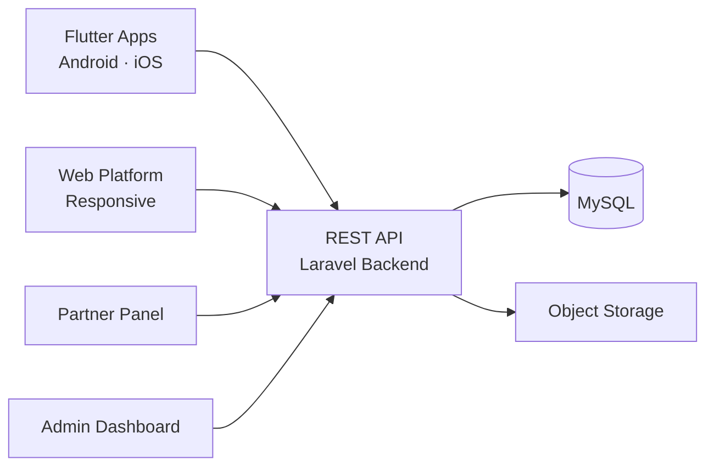

# Apple Ai Realm Clone — White-Label Solution by Miracuves

---

## Table of Contents

1. [Who Is This For?](#who-is-this-for)
2. [How It Works](#how-it-works)
3. [Core Features](#core-features)
4. [Architecture](#architecture)
5. [Revenue Streams](#revenue-streams)
6. [What's Included](#whats-included)
7. [Deployment Timeline](#deployment-timeline)
8. [Why Not Build From Scratch?](#why-not-build-from-scratch)
9. [Market Opportunity](#market-opportunity)
10. [Client Testimonials](#client-testimonials)
11. [FAQ](#faq)
12. [Resources](#resources)
13. [About Miracuves](#about-miracuves)

## Live Demos

| Environment | URL | What you can test |
|---|---|---|
| Web Platform | [mxai.mimeld.com](https://mxai.mimeld.com) | Full experience in the browser |
| Admin Dashboard | [Solution page → Demo](https://miracuves.com/apple-ai-realm-clone/#demo) | Users, content, plans, analytics |

Demo credentials: [miracuves.com/apple-ai-realm-clone -> Demo section](https://miracuves.com/apple-ai-realm-clone/#demo)

## What Makes This Apple Ai Realm Clone Different

<!-- TODO: fill 3-5 vertical-specific differentiators -->

## Who Is This For?

| Buyer Type | Use Case |
|---|---|
| Startup Founders | Launch a branded AI assistant for a vertical market |
| Enterprise Teams | Internal AI productivity tool for employees |
| Agencies / Resellers | White-label and deliver to your own clients |

---

## How It Works

1. User opens the app and starts a conversation or selects a workflow
2. The AI engine processes the request using natural language understanding
3. For workflows, the platform executes a multi-step automation sequence
4. Responses are generated with context awareness and memory of past interactions
5. Sensitive data is processed with privacy-first handling and encryption

---

## Core Features

### User App
- Conversational AI chat with context memory
- Pre-built workflow templates and custom builder
- Smart suggestions based on usage patterns
- Voice and text input support
- Multi-language support

### Workflow Engine
- Visual workflow builder with drag-and-drop steps
- Conditional logic and branching
- Third-party API integration triggers
- Scheduled and event-driven automations
- Custom knowledge base integration

### Admin Panel
- User management and access control
- AI model configuration and tuning
- Usage analytics and cost tracking
- Content moderation and safety filters

---

## Advanced Features

The platform integrates AI-powered features that reduce manual overhead and capture revenue opportunities:

- **Conversational AI Engine** - Natural language understanding with memory and multi-turn conversations
- **Smart Suggestions** - AI-powered recommendations based on user behavior patterns
- **Workflow Automation** - Multi-step AI-driven automations with conditional logic
- **Content Generation** - Text, code, and document generation with customizable tone

---

## Apps and Web Panels

| Module | Description |
|---|---|
| User App (iOS + Android) | Chat, workflows, suggestions, history |
| Web Dashboard | Full browser-based interface for desktop users |
| Admin Web Panel | Users, models, analytics, moderation |
| Workflow Builder | Visual automation designer |

---

## Architecture

**Stack:**

| Layer | Technology |
|---|---|
| Mobile Apps | Flutter (iOS + Android, single codebase) |
| Backend API | Node.js + Express |
| Database | MongoDB |
| AI Layer | OpenAI / Anthropic / custom LLM integration |
| Vector Store | Pinecone / Weaviate for knowledge base |
| Real-time | WebSockets (Socket.io) |
| Notifications | Firebase Cloud Messaging (FCM) |
| Cloud Hosting | AWS / DigitalOcean / Contabo VPS |
| Admin Panel | React.js |

---

## Revenue Streams

The platform is engineered to generate revenue from day one through multiple complementary channels:

- **Subscription plans** - monthly/yearly tiers with usage limits
- **Pay-per-use credits** - token-based billing for AI operations
- **Enterprise licenses** - custom contracts for large teams
- **API access tiers** - developers pay for API calls

---

## Security and Compliance

- OTP-based authentication
- SSL/TLS encrypted API communication
- GDPR-ready data handling

---

## What's Included

| Plan | Price | What You Get |
|---|---|---|
| Standard | **$3,299** | Complete source code, all apps, admin panel, rebranding, 1 year updates |
| Enterprise | Custom Quote | Everything in Standard + custom features, multi-region, priority support |

**What is included:**

- User App (iOS + Android)
- Web Dashboard
- Admin Web Panel
- Workflow Builder
- Full Source Code
- Complete Rebranding (your logo, colors, app name)
- Server Deployment
- App Store and Google Play Submission Support
- 60 Days Free Bug Support
- Free 1-Year Updates

---
**Pricing:** from **$3,299** — transparent on the [solution page](https://miracuves.com/apple-ai-realm-clone/#pricing).

## Deployment Timeline

| Day | Milestone |
|---|---|
| Day 1 | Server setup, environment configuration, initial deployment |
| Day 2 | White-labeling - app name, logo, colors, splash screens |
| Day 3 | Payment gateway integration + third-party API configuration |
| Day 4 | Custom feature implementation (if applicable) |
| Day 5 | QA, testing, bug fixes across all panels |
| Day 6 | App Store + Google Play submission + Go-live |

> **Average go-live: 6 business days from payment confirmation.**

---

## Why Not Build From Scratch?

| Factor | Build from Scratch | Miracuves Solution |
|---|---|---|
| Time to Launch | 6-12 months | 6 days |
| Development Cost | $60,000-$150,000 | From $3,299 |
| Source Code Ownership | Yes | Yes |
| Customization | Full | Full |
| Post-Launch Support | Depends on team | 60 days included |
| Risk | High | Low |

---

## Market Opportunity

| Metric | Data |
|---|---|
| Global AI Assistant Market (2024) | $12 billion |
| Projected Market Size (2030) | $52 billion |
| CAGR | ~28% |
| Key Growth Segments | Productivity, Healthcare, Legal, Finance |

> Source: Statista, Grand View Research, Allied Market Research

---

## Successful Verticals

- Productivity and task management AI assistants
- Healthcare symptom checking and medical Q&A
- Legal research and contract analysis
- Financial planning and investment advisory
- Education and tutoring platforms

---

## Client Testimonials

> *"Miracuves built our vertical AI assistant in under a week. The workflow engine is incredibly flexible."*
> - Founder, LegalTech Startup

---

## FAQ

**How much does an AI assistant app cost?**
A white-label Apple AI clone from Miracuves starts at $3,299 with complete source code ownership.

**Can I use my own AI model?**
Yes. The platform supports OpenAI, Anthropic, open-source LLMs, and custom models via API.

**Is the data privacy-first?**
Yes. The architecture supports on-device processing and encrypted data handling for compliance.

**Do I get the source code?**
Yes. Complete source code ownership is included.

**How long does it take to launch?**
6 business days from payment confirmation.

---

## Related Solutions

Explore our other white-label clone solutions:

- [ChatGPT Clone - AI Chatbot](https://github.com/Miracuves-Solutions/ChatGPT-Clone)
- [Midjourney Clone - AI Image Gen](https://github.com/Miracuves-Solutions/Midjourney-Clone)
- [Jasper Clone - AI Content](https://github.com/Miracuves-Solutions/Jasper-Clone)

---

## Resources

- [Full Solution Page](https://miracuves.com/apple-ai-realm-clone/) — features, pricing, demos, FAQ

## Get Started

**Ready to launch your AI assistant platform?**

| Channel | Link |
|---|---|
| Full Solution Page | [miracuves.com/apple-ai-realm-clone](https://miracuves.com/apple-ai-realm-clone/) |
| Email | info@miracuves.com |
| WhatsApp | [+91 98300 09649](https://wa.me/919830009649) |
| Book a Call | [Free Consultation](https://miracuves.com/contact/) |

---

## About Miracuves

**Miracuves Solutions Pvt. Ltd.** is a Mumbai-based software company specializing in white-label clone app solutions across 12+ industries.

- 90+ ready-to-deploy solutions
- 6-day delivery guarantee
- 60+ engineers on staff
- 3,900+ apps delivered
- Full source code ownership
- Clients across 40+ countries including India and USA

[Explore all 90+ solutions at miracuves.com](https://miracuves.com)

---

## Disclaimer

This product is independently developed by Miracuves. All product names, logos, and brands are property of their respective owners. Use of these names does not imply endorsement.

---

*(c) 2026 Miracuves Solutions Pvt. Ltd. | Mumbai, India*
*This repository contains product documentation only - no proprietary source code is published here.*

*Keywords: apple ai realm clone, apple ai realm script, white label solution, laravel flutter app, clone script*

---

### Note on This Repository

This repository is a product overview. The full source code is delivered to clients on purchase. For a hands-on evaluation, use the live demos above; credentials are public on the solution page.

<!--
=========================================================
GENERATED FROM MIRACUVES NETFLIX-CLONE README TEMPLATE
Canon: 6 working days, from $2,799 floor, 60 days support + 12 months updates.
Never use 3 days. See https://miracuves.com/facts/ for audited claims.
=========================================================
-->
